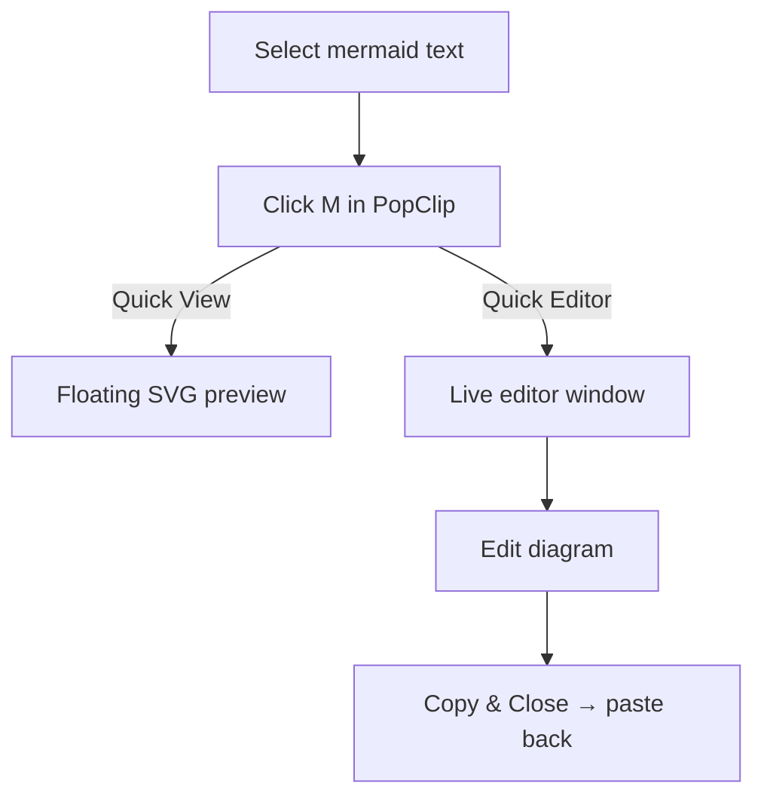

# Mermaid Preview

A PopClip extension that renders selected [Mermaid](https://mermaid.js.org/) diagram syntax. Two modes are available via the extension settings:

| Mode | How it works |
|------|-------------|
| **Quick View** | Renders the diagram to SVG (via `mmdc` or mermaid.ink) and displays it in a floating Quick Look window. Press Space or Esc to close. |
| **Quick Editor** | Opens a floating split-pane editor: live mermaid.js preview on the right, editable source on the left. Click **Copy & Close** to put the edited source on the clipboard ready to paste back. |

## Usage

Select any Mermaid diagram — a fenced code block or raw syntax — then click the **M** button in PopClip. Change the mode in PopClip's extension settings (long-press the M button or open preferences).



## Requirements

- macOS 12+ (WKWebView ES module support)
- Xcode Command Line Tools — provides `/usr/bin/swift` used to run the Swift scripts
- **Quick View only:** internet access **or** [mermaid-cli](https://github.com/mermaid-js/mermaid-cli) installed locally:
  ```
  npm install -g @mermaid-js/mermaid-cli
  ```
- **Quick Editor:** internet access (loads mermaid.js from [esm.sh](https://esm.sh/mermaid) — always the latest version)

## Installation

Double-click `MermaidPreview.popclipext` to install.

## Notes

- Both `qlf.swift` and `mermaid_editor.swift` are compiled by Swift on first use — expect a few seconds' delay the first time each mode is run.
- Temp files (`.svg` for Quick View, `.mmd` for Quick Editor) are deleted automatically when the window closes.
- Quick View falls back to [mermaid.ink](https://mermaid.ink) when `mmdc` is not installed; diagram source is sent to that service.
- Quick Editor always renders client-side via mermaid.js — nothing is sent to any server.
