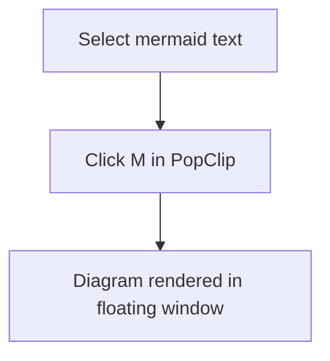

# Mermaid Preview

A PopClip extension that renders selected [Mermaid](https://mermaid.js.org/) diagram syntax and displays it in a floating Quick Look window.

## Usage

Select any Mermaid diagram — either a fenced code block or raw syntax — then click the **M** button in PopClip.



Press **Space** or **Esc** to close the preview.

## Requirements

- macOS with Xcode Command Line Tools (`swift` at `/usr/bin/swift`)
- For local rendering: [mermaid-cli](https://github.com/mermaid-js/mermaid-cli) (`mmdc`)
  ```
  npm install -g @mermaid-js/mermaid-cli
  ```
- Without `mmdc`, diagrams are rendered via [mermaid.ink](https://mermaid.ink) (requires internet)

## Supported diagram types

The button appears when the selection contains any of: `graph`, `flowchart`, `sequenceDiagram`, `classDiagram`, `stateDiagram`, `erDiagram`, `gantt`, `pie`, `gitGraph`, `mindmap`, `timeline`, `xychart-beta`, `quadrantChart`, or a fenced ` ```mermaid ` block.

## Installation

Double-click `MermaidPreview.popclipext` to install.

## Notes

- `qlf.swift` is compiled by Swift on first use — expect a few seconds' delay the first time.
- The temp SVG file is deleted automatically when the preview window closes.
- Diagrams are rendered locally with `mmdc` when available; the online fallback sends diagram source to mermaid.ink.
